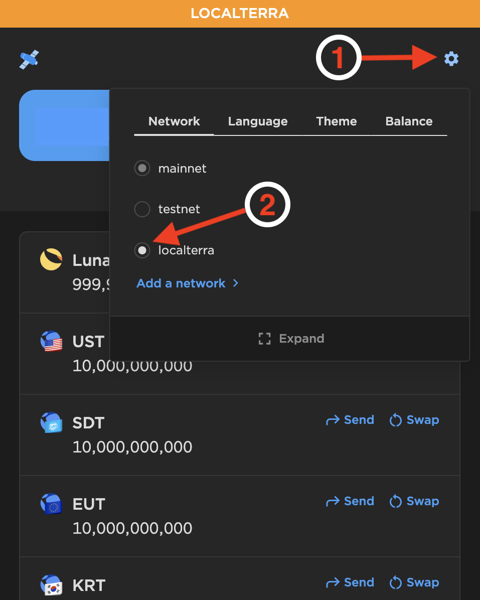
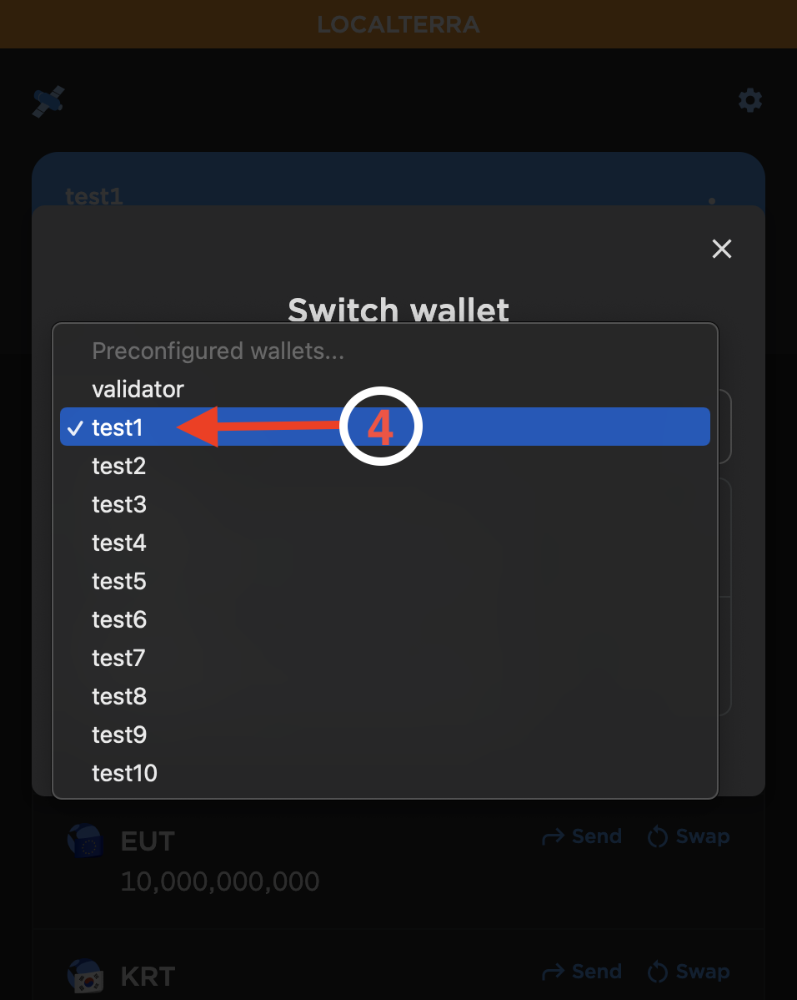
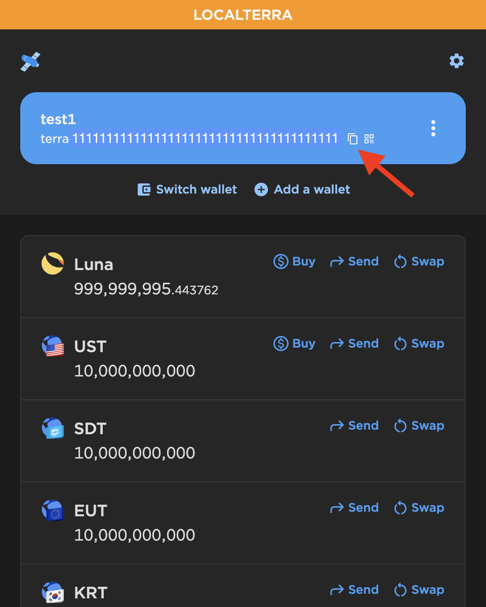
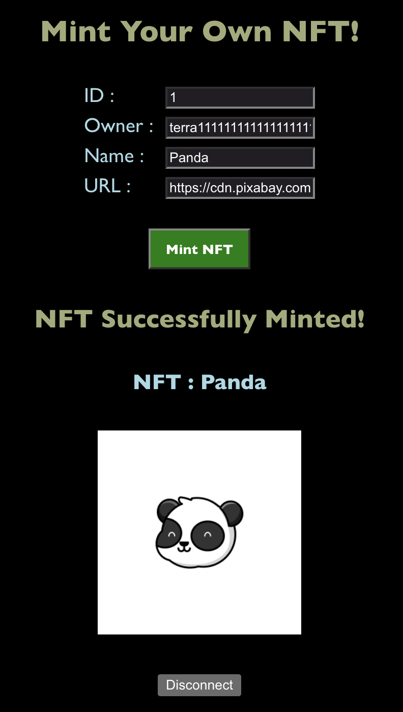

# How to Mint Your Very Own NFT on the Terra Blockchain

NFTs have been generating a lot of buzz in the blockchain community, particularly with their use in trading digital art. NFTs, or non-fungible tokens, are unique digital items that may be showcased and bought/sold on the blockcahin. Buying one of these unique items gives you ownership over the unique digital creation, somewhat similar to buying a distinct painting or art piece.

In this tutorial, we will go over how you may mint your own unique NFT on the Terra blockchain. This allows you to create your own form of digital art for sale to millions of users that are currently utilizing the Terra ecosystem.

If you would like to view available collections that are on sale on the Terra blockchain, you may navigate to the [randomearth marketplace](https://randomearth.io/collections).

## Getting Started

These instructions assume that you have already set up a Terra Station wallet in order to interact with the Terra blockchain. You may create a new wallet on the [Terra Station extension](https://docs.terra.money/docs/learn/terra-station/download/terra-station-extension.html) on Google Chrome which you will need to install in order to confirm transactions on our application.

We will also install [localterra](https://github.com/terra-money/LocalTerra), a Terra blockchain and ecosystem which runs on your personal computer for testing, and [terrain](https://github.com/terra-money/terrain), a Terra development environment for smart contract development. Be sure to follow the instructions to install and run all applications which are dependencies for both localterra as well as terrain.

After installing the above dependencies, you may clone this repository to the directory of your choice using the following command:

`git clone https://github.com/collazo6/nft_on_terra.git`

Change directory into the cloned repository and run the command `npm install` in your terminal to install all relevant Node dependencies. If you have not installed npm (Node Package Manager) on your computer, you may find instructions on how to do so based on your operating system [here](https://kinsta.com/blog/how-to-install-node-js/).
<br/>
<br/>

## Wallet Setup

There are a few changes we have to make before we may deploy our smart contract and create our first NFT. To test our smart contract functionality, we will be utilizing the preconfigured testing wallet `test1`. This wallet will be available on any Terra Station generated wallet. In order to view our test1 wallet, we may navigate to localterra on our Terra Station extension on Google Chrome and switch our wallet to the preconfigured testing wallet.
<br/>

### Step 1

Open the Terra Station extension on your Google Chrome web browser. Click on the settings icon in the upper right-hand corner and select the **localterra** network.
<br/>

<div align="center">
  
</div>
<br/>

### Step 2

Next, we will click on _Switch wallet_, then click on the drop down menu that appears in the subsequent popup and finally select the test1 wallet from the drop down list that appears.
<br/>

<div align="center">
  
</div>
<br/>
<div align="center">
  
</div>
<br/>
Now that we have successfully switched to our testing wallet on localterra, we have setup our environment to be able to deploy our smart contract.
<br/>
<br/>

## Contract Setup & Deployment

### Updating the Instantiate Message

Before we may deploy our contract and begin minting our NFT, we must make a change to the `config.terrain.json` file in this repository. Open this file and find the instantiate message section below:

```
"instantiateMsg": {
  "name":"NFT Collection Name",
  "symbol":"NFTSYMBOL",
  "minter":"terraxxxxxxxxxxxxxxxxxxxxxxxxxxxxxxxxxxxxxxx"
}
```

We must first update the desired _name_ and _symbol_ that will correspond to our minted NFT. Also, the _minter_ will have to be updated to our test1 wallet address. This may be copied directly from our Terra Station extension.
<br/>
<br/>

<div align="center">
  
</div>
<br/>
<br/>

In this tutorial, we will be uploading an image of a panda to our Animal NFTs collection. Therefore, we may update the parameters in the instantiate message to the following:

```
"instantiateMsg": {
  "name":"Animal NFTs",
  "symbol":"ANMLZ",
  "minter":"terra111111111111111111111111111111111111111"
}
```

### Deploy Contract to localterra

Now, we are finally ready to deploy our contract and run our application. First, ensure you are running localterra in a tab on your terminal. If you need to view instructions on how to get localterra up and running, please refer to the [localterra documentation](https://github.com/terra-money/LocalTerra).

Once localterra is up and running, run the following command in your terminal in order to deploy the contract with your test1 wallet as the owner.

`terrain deploy cw721-metadata-onchain --signer test1`

### Mint an NFT!

Once the contract deployment is successfully completed, you may change into the `frontend` directory. From here, you may run `npm install` to install all necessary Node dependencies as well as the command `npm start` to start up our NFT minting application.
<br/>
<br/>

<div align="center">
  
</div>
<br/>

As shown above, you may fill out all of the necessary information on the form to mint your first NFT. ID may be any number that you would like to correspond to the ID of the new NFT. The Owner is the wallet address which will be the owner of the newly minted NFT (our test1 wallet address in this case). You may then enter a name for the NFT as well as input its corresponding URL.

In general, many prefer to host their NFTs on IPFS (Interplanetary File System). You may use a variety of resources in order to post an NFT on IPFS. One service that you may use is [pinata](https://www.pinata.cloud/). In this example I have copied an image address of a copyright free image from [Pixabay](https://pixabay.com/).

Now we are ready to mint our NFT! After we click on the _Mint NFT_ button, we will be presented with information on our newly minted NFT!
<br/>
<br/>

<div align="center">
  
</div>
<br/>
